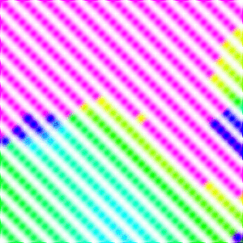
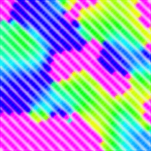

# metropolis-fim-cuda-mathematica

*Metropolis Monte-Carlo algorithm generalised on a quantum system with $S > 1/2$ and $L \neq 0$ written on C++CUDA and Mathematica*

Type
```shell
wolframscript -file generate.wls 7x7x2 df=10 cycles=100 hitemp=100 att=30
```
it will generate and evolve spin cluster 7x7x2 of $Fe Cr_2 S_4$ cells. It contains two magnetic subblatice with a strong cubic anisotropy. Each spin is threated as a real quantum system including true orbital degrees of freedom.



The cluster size is too small to form domains



At this size it is already almost enough

## Required 
- Freeware Wolfram Engine
- CUDA
- blaze-lib
- blas/lapack
- C++14

## Build
```shell
nvcc -O2 -Xptxas -O2,-v sim.cu -llapack -lblas -o sim
```
